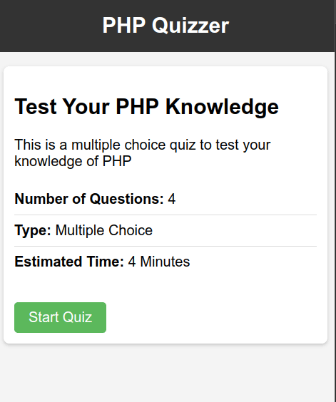

# PHP Quizzer

## Overview

**PHP Quizzer** is a dynamic web-based quiz application built using PHP, MySQL, and HTML/CSS. It allows users to test their knowledge by answering a series of questions and see their final score upon completion. This project was developed as a way to enhance my understanding of PHP, session management, and working with databases.

---

## Screenshots

## Features

- **Dynamic Questions**: Each question is fetched dynamically from a MySQL database, ensuring scalability.
- **Multiple Choice Answers**: Users can select from multiple choice answers for each question.
- **Score Tracking**: Session management is used to keep track of the user's score.
- **Results Page**: Upon completion, users are presented with their final score.
- **Responsive Design**: The application is designed to be mobile-friendly and works across different devices.

---

## Technologies Used

- **Backend**: PHP, MySQL
- **Frontend**: HTML, CSS
- **Database**: MySQL (for storing questions, choices, and correct answers)
- **Version Control**: Git

---

## How This Project Helped Me Improve

Working on **PHP Quizzer** has been an incredible learning experience. It helped me sharpen the following skills:

- **PHP Fundamentals**: Implementing server-side logic, managing sessions, and handling form submissions in PHP.
- **Database Design**: Understanding relational database concepts, writing SQL queries, and working with PDO for secure database interactions.
- **Session Management**: Learning how to track user progress across multiple pages using PHP sessions.
- **Problem Solving**: Debugging errors and improving the flow of the application taught me how to approach problem-solving in a structured way.
- **Responsive Design**: Ensuring the application works well on different devices, which introduced me to important web design practices.

Through this project, I was able to reinforce my knowledge of the fundamentals while building something interactive and fun. It provided real-world experience in connecting the front-end with the back-end using PHP and MySQL.

---

## Contributing

Contributions are welcome! If you have any suggestions for new features or improvements, feel free to open an issue or submit a pull request. Please follow the code of conduct outlined in the repository.

---

## License

This project is licensed under the MIT License. You are free to use and modify the project as per the terms of the license.

---

### Acknowledgments

Special thanks to [PHP.net](https://www.php.net/) and the developer community for providing extensive documentation and support throughout the development of this project.

---
